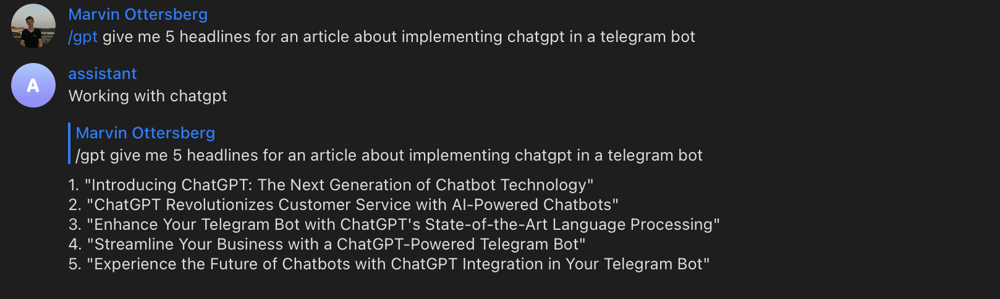

# chatgpt-telegram-assistant
A telegram bot that allows you to chat with ChatGPT.

The package to interact with ChatGPT is from [here](https://github.com/acheong08/ChatGPT). Thanks to [Antonio Cheong](https://github.com/acheong08) for the great work!!!

# Currently working on...

- [X] : Run ChatGPT in Telegram locally
- [X] : Let multiple people join with the same
- [ ] : Write article on Medium
- [ ] : Run ChatGPT in Telegram on a server

# Installation

Create a Bot with [Botfather](https://t.me/botfather) and get the API key.

Add BOT_TOKEN to a file named .env in the root directory of the project. 

Install Telegram Bot API. You can do this by running the following command in your terminal:

    pip install pyTelegramBotAPI

Follow Installation and Configuration steps to install ChatGPT from [here](https://github.com/acheong08/ChatGPT)

Add SESSION_TOKEN to config.json and .env-file.

# Usage

run the following command in your terminal:

    python3 bot.py

## Result

# Troubleshooting

The config.json file contained a **"proxy"**-field and it lead to an error I couldn't solve. I removed it and it worked. If you have the same problem, try to remove the field.

If you have some problems with selenium or chromedriver, make sure to have Chrome installed.